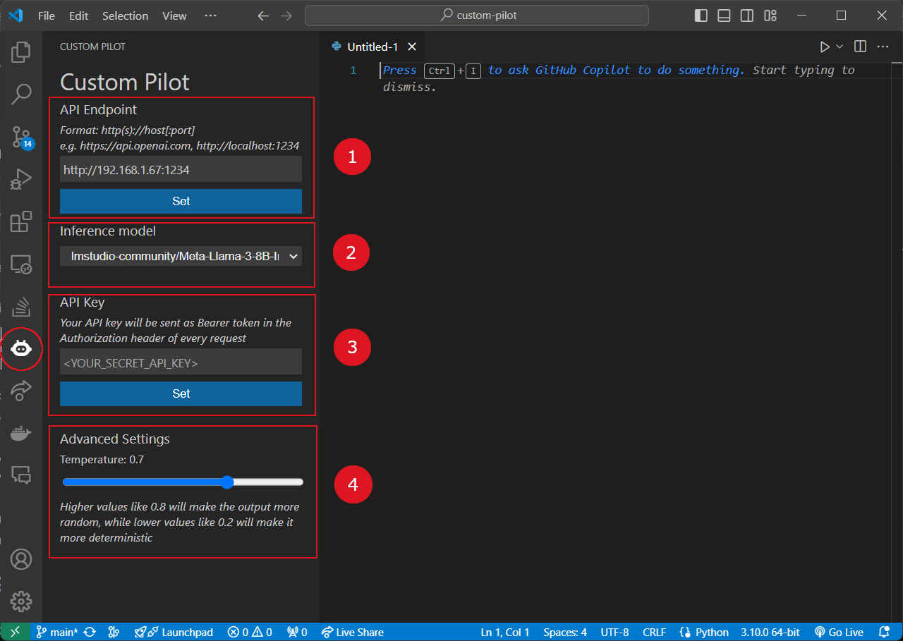

# Custom Pilot
Custom Pilot is a Visual Studio Code extension framework that lets you easily integrate your custom code completion model into VS Code.

## Getting started
You can use any API server following OpenAI's [API format](https://platform.openai.com/docs/api-reference).
In particular, the API server should serve the endpoints:
* GET /v1/models
* POST /v1/completions

You can set your configuration in the Sidebar panel of the extension:
1. Set the API server URL
2. Choose an inference model from the dropdown menu
3. If your API requires authentication, enter your API Key. It will be sent in the Authorization header of every request
4. Optionally, adjust the advanced settings as you like

The model you selected will be used to provide completions in any programming language and on any file.

## Use Custom Pilot with LM Studio
With LM Studio, you can run LLMs offline on your machine. You can use Custom Pilot to integrate your LLM model running in LM Studio into VS Code. 

Firstly, follow [this guide](https://lmstudio.ai/docs/local-server#using-the-local-server) to run a local webserver in LM Studio.

Then, set the API server URL to `http://<ip_address>:1234` in the Sidebar panel of Custom Pilot, where <ip_address> is the IP address of the machine running LM Studio. For example, if you are running LM Studio on your local machine, you can set the URL to `http://localhost:1234`.

Choose an inference model from the dropdown menu, and you are ready to use your LLM model in VS Code!

