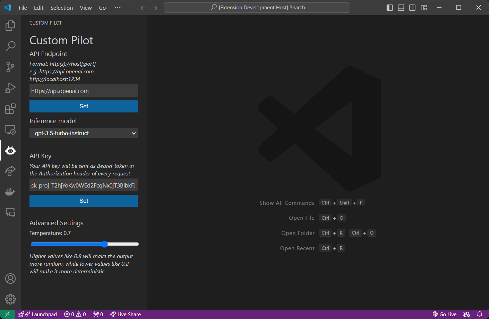

# Custom Pilot
Custom Pilot is a Visual Studio Code extension framework that lets you easily integrate your custom code completion model into VS Code.

## Getting started
You can use any API server following OpenAI's [API format](https://platform.openai.com/docs/api-reference).
In particular, the API server should serve the endpoints:
* GET /v1/models
* POST /v1/completions

You can set your configuration in the Sidebar panel of the extension:
1. Set the API server URL
2. Choose an inference model from the dropdown menu
3. If your API requires authentication, enter your API Key. It will be sent in the Authorization header of every request
4. Optionally, adjust the advanced settings as you like

The model you selected will be used to make completions in any programming language and on any file. In the future, it will be possible to choose a specific model for each language. 